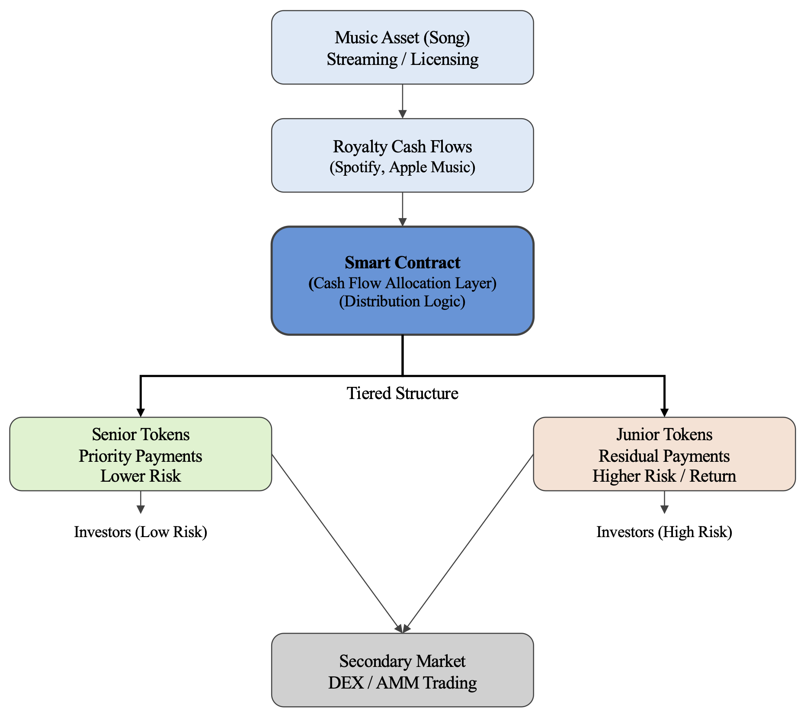
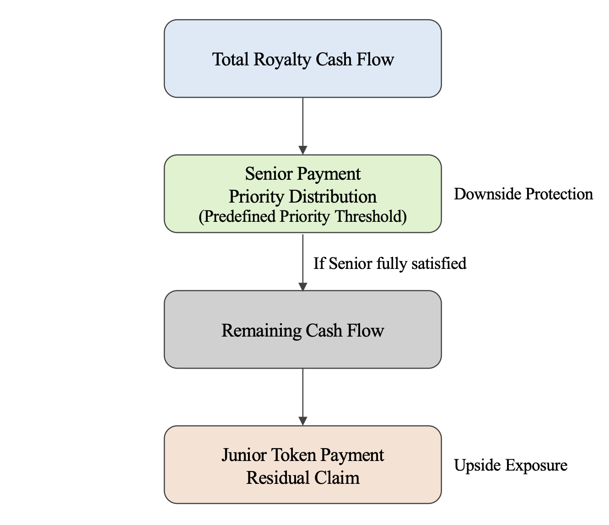

# Music Royalty Tokenization (Dual-Token Structure)

This project implements a tokenization framework for music royalty cash flows using a dual-token structure.

## Overview

The design converts future royalty income into tradable financial claims on blockchain.

Two types of tokens are introduced:

- **Senior Token (SNR)**: priority claim on royalty income with lower risk exposure
- **Junior Token (JNR)**: residual claim with higher risk and return potential

The structure is designed to reflect the uneven and uncertain nature of music revenue streams.

## System Architecture

The following diagram illustrates how royalty cash flows are transformed into tokenized claims.

## Cash Flow Waterfall

The waterfall mechanism defines the priority structure between Senior and Junior tokens.

## Token Design

The tokenization uses a fungible token (FT) structure, as royalty income is divisible and distributed over time.

Key features:

- Tokens represent proportional claims on future royalty cash flows
- Two-tier structure separates risk into different tranches
- Fixed supply determined at issuance
- Fully transferable and divisible

The design embeds a simplified version of a cash flow waterfall mechanism, where Senior Tokens receive priority distributions before Junior Tokens.

## Economic Logic

The underlying asset generates continuous but uncertain cash flows driven by streaming activity and licensing demand.

Tokenization improves:

- **Liquidity**: enables fractional ownership and secondary trading
- **Access**: lowers entry barriers for investors
- **Transparency**: smart contracts automate distribution and record transactions

The dual-token structure allows investors to select exposure based on their risk preference, rather than holding a single undifferentiated claim.

## Smart Contracts

This repository includes three simplified smart contracts:

- `SeniorToken.sol`
- `JuniorToken.sol`
- `RoyaltyDistributor.sol`

These contracts provide a simplified on-chain representation of the financial structure described in the report that focuses on core logic.

## Deployment

The contracts are intended to be deployed on an Ethereum test network (e.g. Sepolia).

Contract Address:

- Senior Token: 0x1AC5a80A6e9b72F5D91a9972D998Ab2BCC0Cf2D2
- Junior Token: 0x2D98ddEe79908F082D91501b8D4f9442a2d05442
- Royalty Distributor: 0x335DE7B4859b3994a7e5E40E9903dCE077d3D322

## Disclaimer

This project is developed for academic purposes as part of a coursework assignment.

The implementation is a simplified prototype and does not represent a fully functional financial product.